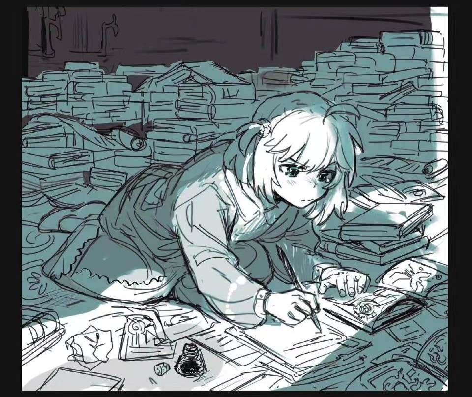

## :ghost: Here,you will see a soul.​

> 🎵  Mode: 剑走翩风

<b>My State of Mind</b> (source from Pixiv@Koyomania)

***

Hi,here is WendaoLee (or Erika Lee),a nobody. 

My blogs (most of that is Chinese): [leewendao.otterstack.cn](https://leewendao.otterstack.cn)

My most developed programming language:

- High Skill: 
- Can use to finish a project independently:
- Interested in: 

Currently I'm maintaining these open-source projects:

- Python Official Documents of `zh-cn`

***

- :sunflower: This card shows the consistent of my Github published repositories.

#### · Recently I Learning For

- Signal And System
- Keyboard

#### ・Future Orientation

- Writing && Reading
- Learning more languages(English,Japanese)

***

